# Диаграммы архитектуры коммуникации микрофронтендов

## 1. Общая архитектура системы

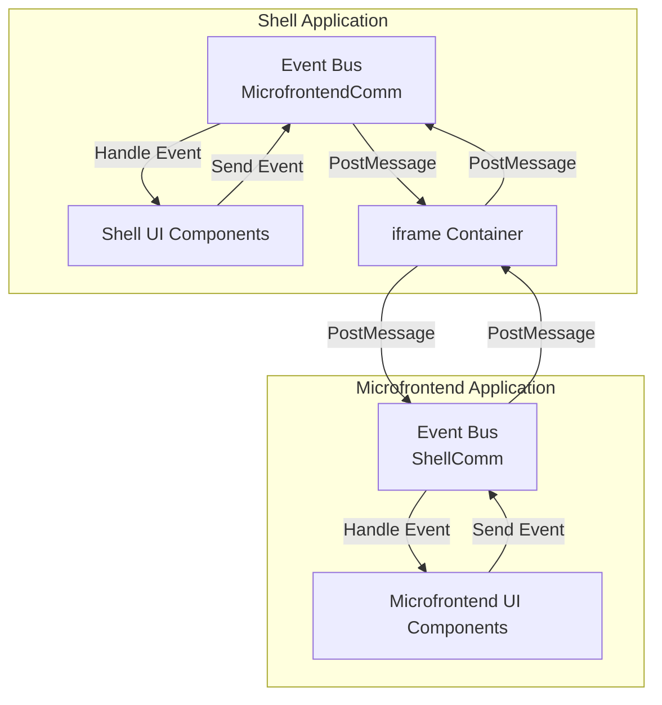

## 2. Последовательность инициализации

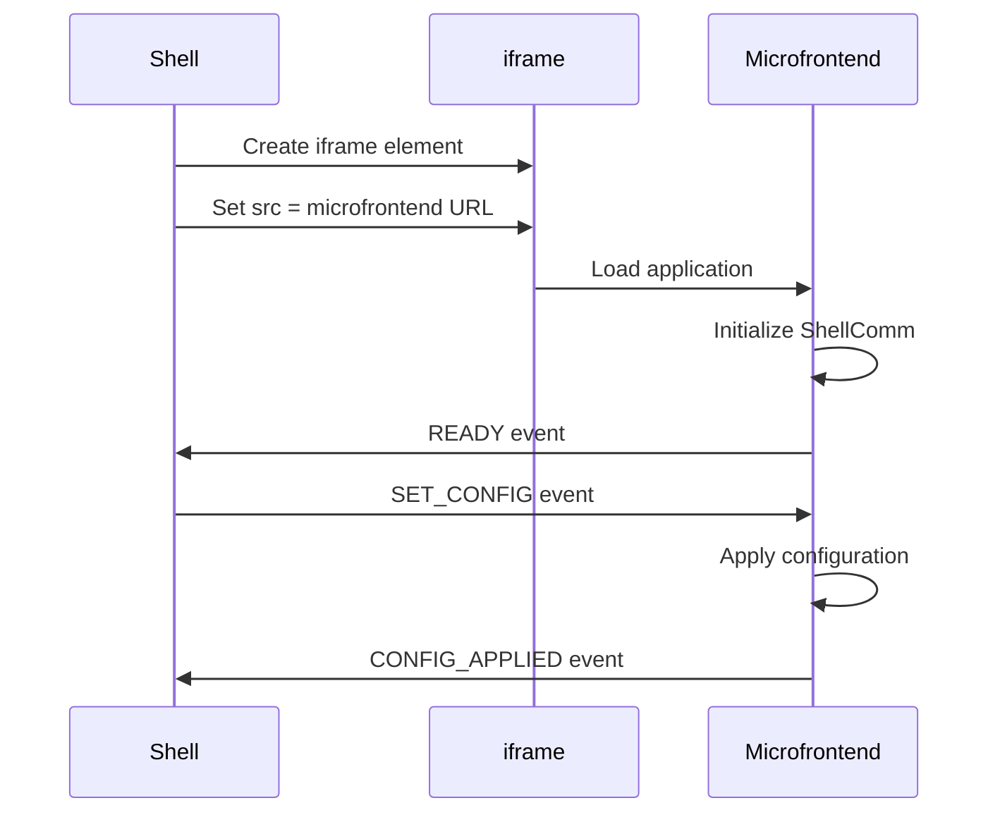

## 3. Обмен событиями (двусторонняя коммуникация)

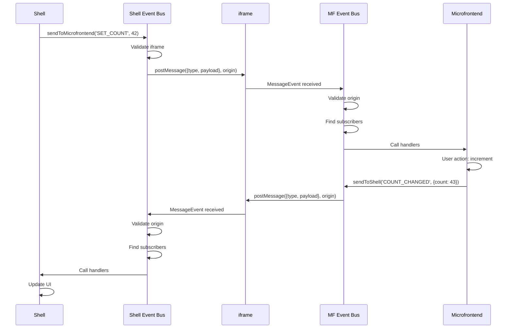

## 4. Структура Event Bus

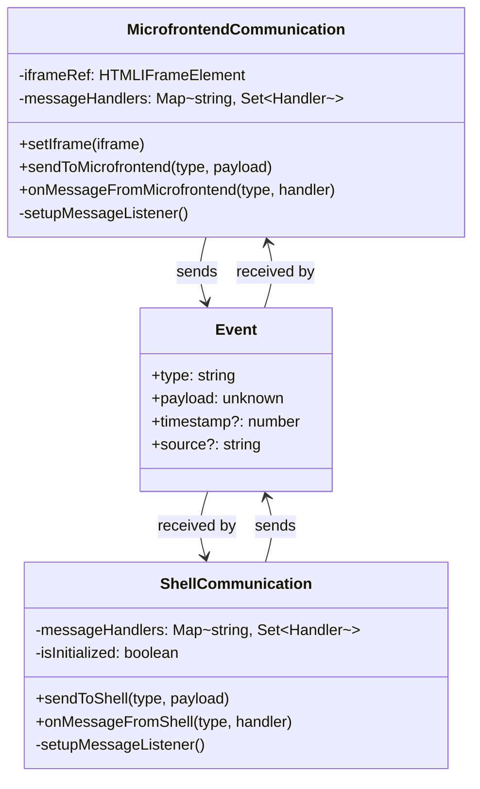

## 5. Жизненный цикл события

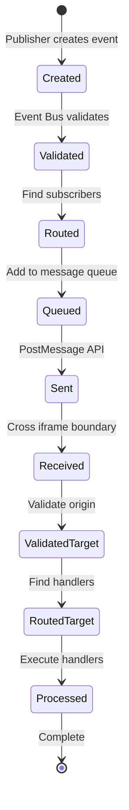

## 6. Паттерн подписки (Pub/Sub)

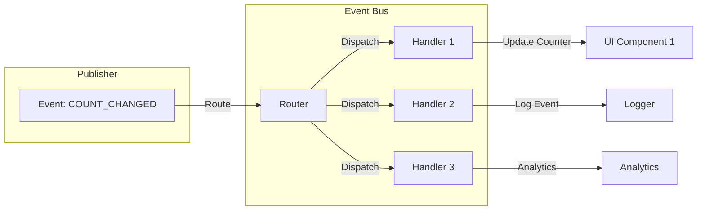

## 7. Множественные микрофронтенды

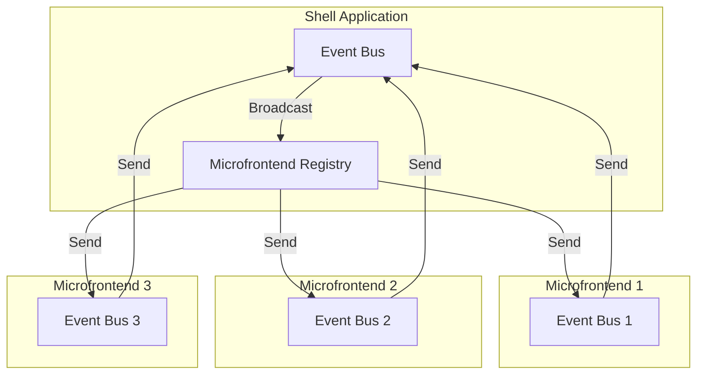

## 8. Безопасность: валидация источника

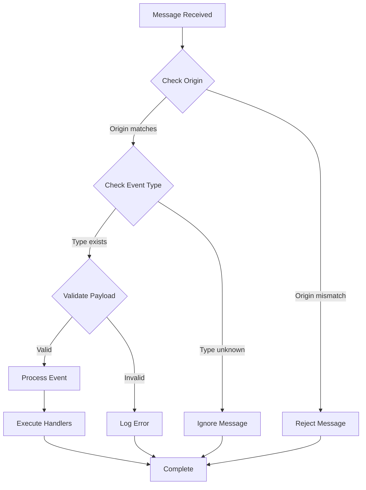

## 9. Middleware цепочка

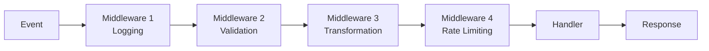

## 10. Синхронизация состояния

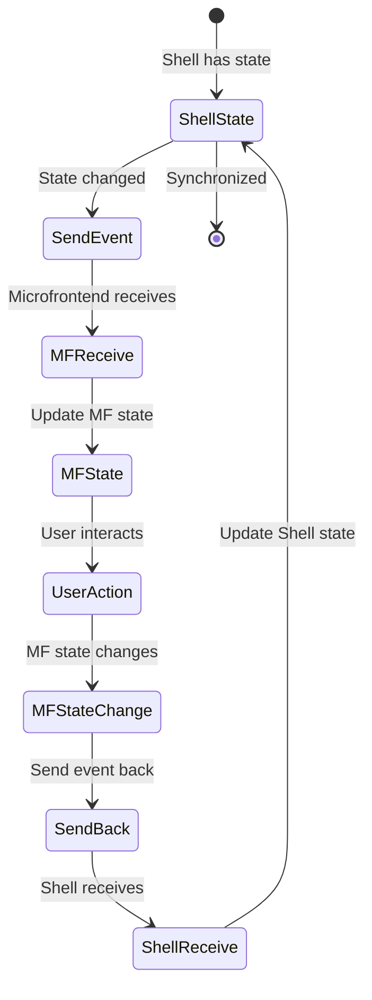

## 11. Обработка ошибок

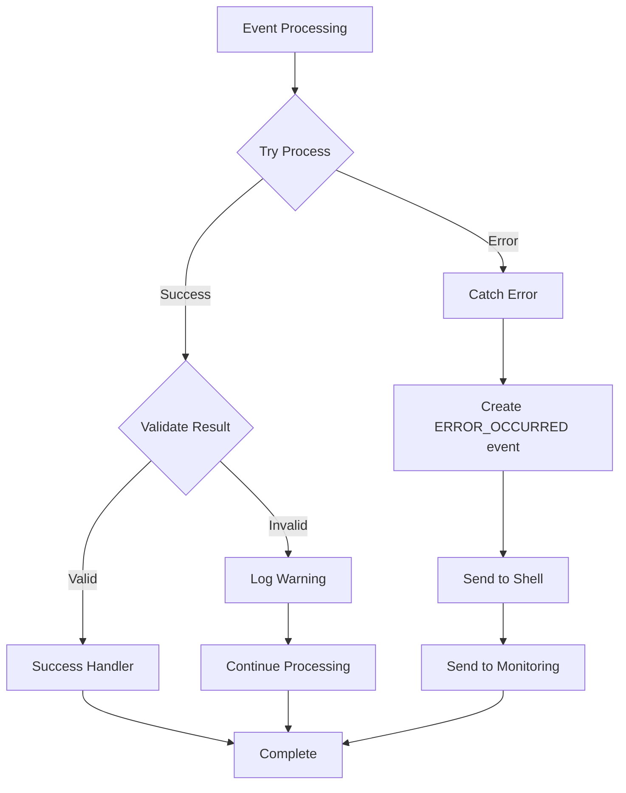

## 12. Архитектура масштабирования

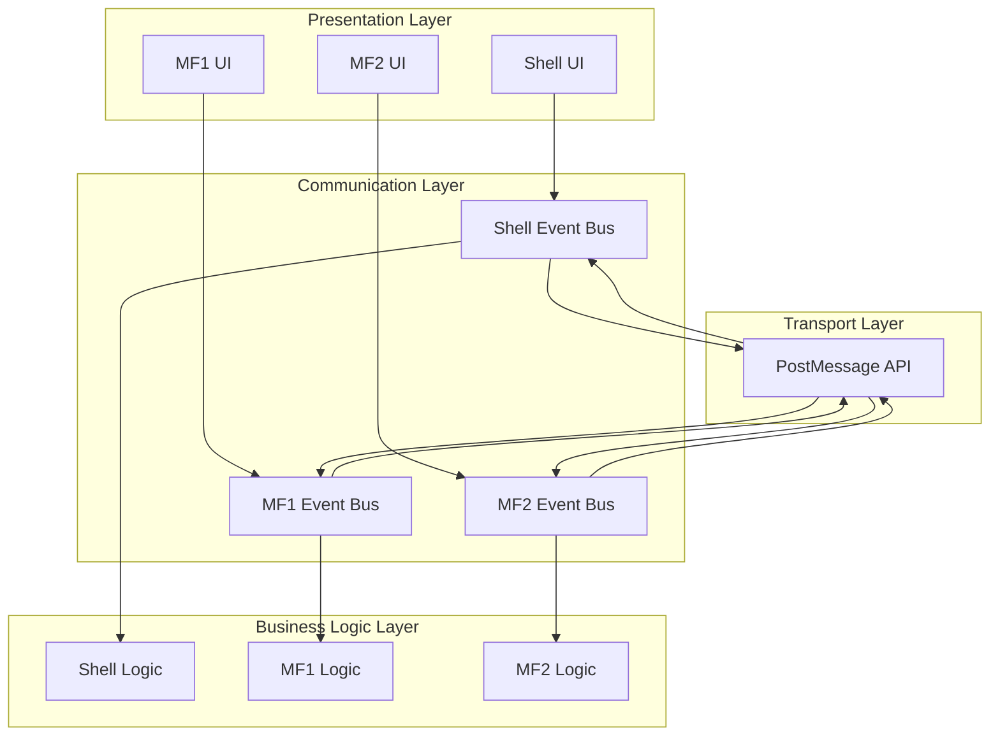

---

**Примечание:** Эти диаграммы можно отрендерить в любом Markdown-редакторе с поддержкой Mermaid (GitHub, GitLab, VS Code с расширением Mermaid, и т.д.)

